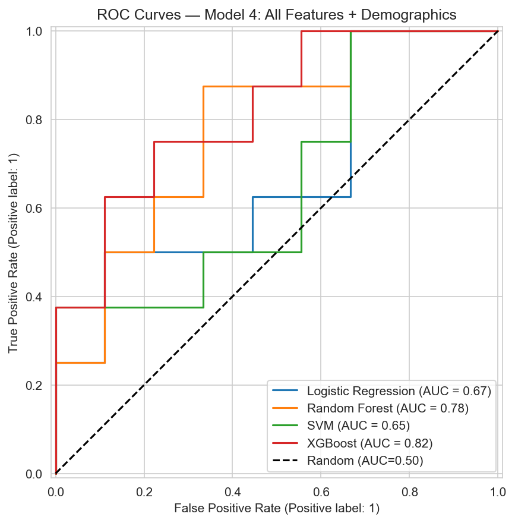
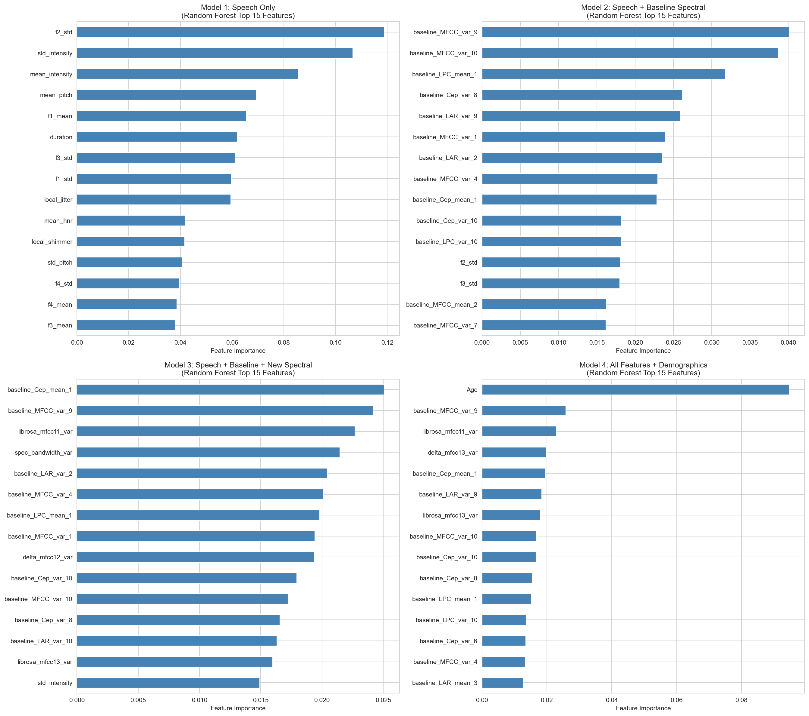
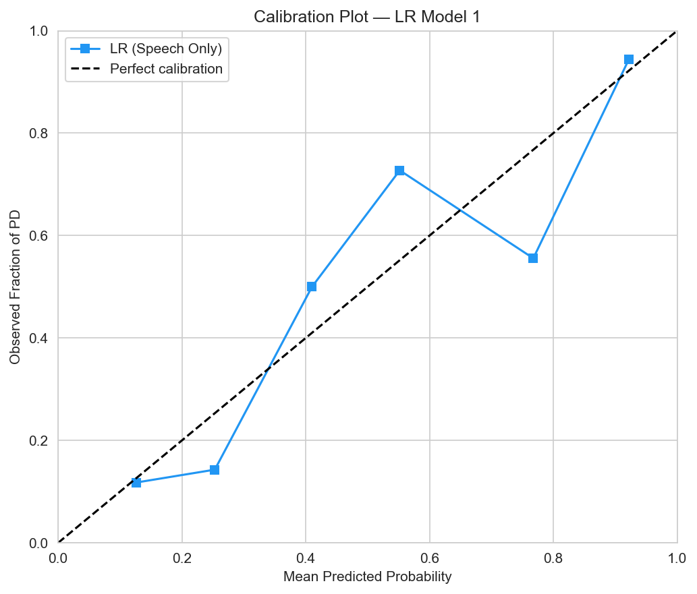
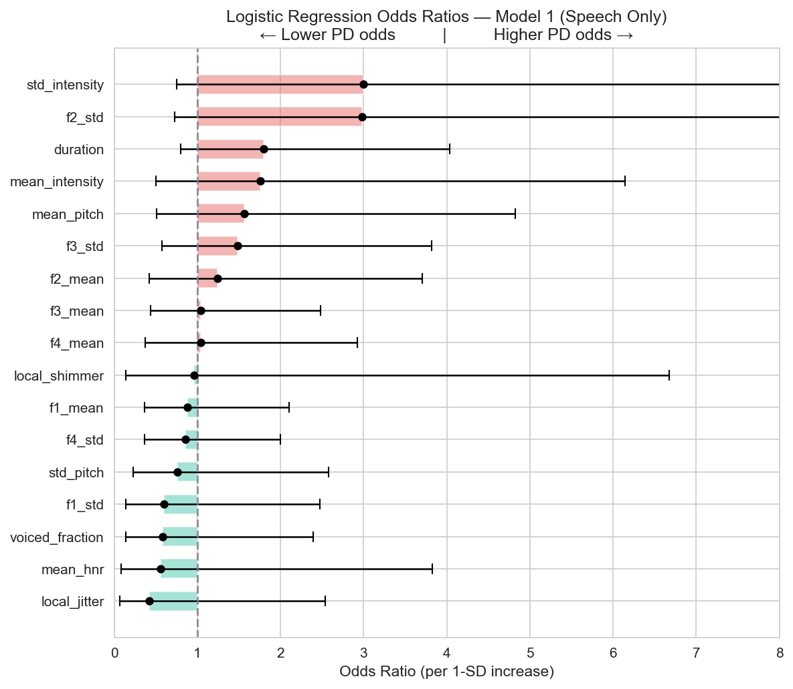

# Parkinson's Disease Detection from Voice Samples

Binary classification of Parkinson's disease (PD) vs. healthy controls (HC) using sustained-vowel voice recordings. Course project for IDS 506 — Healthcare Information Management & Analytics, UIC MS MIS program, Spring 2026.

## Problem

Can acoustic features extracted from a short vowel recording (/a/) reliably distinguish Parkinson's patients from healthy controls? Parkinson's produces characteristic voice changes — increased jitter/shimmer, reduced HNR, altered formant structure — before many motor symptoms are visible, making voice a low-cost, non-invasive screening signal.

## Data

- 81 participants: 40 with Parkinson's (PwPD), 41 healthy controls (HC)
- Each participant recorded a sustained /a/ vowel (mono WAV, 8 kHz)
- Pre-calculated baseline spectral features (LPC, LAR, MFCC mean/variance coefficients) provided alongside raw audio

> Audio files and source data are not included in this repository — they were provided for educational use only under course data-sharing restrictions.

## Methods

Single self-contained notebook (`parkinsons_analysis.ipynb`) running top-to-bottom through seven phases:

| Phase | Description |
|---|---|
| Data prep | 80/20 stratified train/test split (seed=42) |
| EDA | Demographic group comparison; age confound analysis (Mann-Whitney, t-test, chi-square) |
| Speech features | 17 features via Parselmouth/Praat: jitter, shimmer, HNR, pitch, formants F1–F4, voiced fraction |
| Spectral features | 68 features via librosa: 13 MFCCs + 13 delta MFCCs (mean/var), spectral centroid, rolloff, bandwidth, spectral contrast, ZCR |
| Model training | 4 classifiers × 4 feature sets = 16 models; 10-fold stratified CV |
| LR interpretation | Odds ratios with 95% CIs, Hosmer-Lemeshow calibration, Youden's J threshold optimization |
| Feature importance | Random Forest importance, ROC curves, clinical discussion |

**Feature sets built incrementally:**
1. Speech only (17 features)
2. Speech + baseline spectral (97 features)
3. Speech + baseline + new spectral (165 features)
4. All features + demographics (167 features)

## Key Results

- Best single-split AUC: **0.94** (SVM, all features)
- Best CV AUC: **~0.88–0.90** (RF/SVM, feature-selected sets)
- Age confound identified and documented: HC mean age 47.7 vs. PwPD 67.0 (p < 0.0001); age alone AUC = 0.864
- Mann-Whitney feature selection reduced dimensionality from 167 → ~57 significant features without degrading CV performance

### Selected output plots

| | |
|---|---|
|  |  |
|  |  |

## Limitations

- Small N (n=81): 10-fold CV leaves ~7 test samples per fold; results should be interpreted with caution
- Age confound: PwPD group is ~20 years older on average; models may partly capture age rather than PD
- Mean/variance feature summarization loses temporal structure (pitch trajectories, tremor oscillations)
- Single vowel phoneme — generalization to connected speech unknown

## Setup

```bash
pip install -r requirements.txt
jupyter notebook parkinsons_analysis.ipynb
```

**Note:** The notebook requires the audio files (HC_AH/, PD_AH/) and source data spreadsheet to run. These are not included — contact the author if you need a fully reproducible setup.

## Dependencies

`parselmouth`, `librosa`, `soundfile`, `xgboost`, `scikit-learn`, `pandas`, `numpy`, `matplotlib`, `seaborn`, `openpyxl`, `scipy`

## Author

Amir Abdur-Rahim — [amirabdurrahim.com](https://amirabdurrahim.com) · [linkedin.com/in/amir-abdur-rahim](https://www.linkedin.com/in/amir-abdur-rahim)
